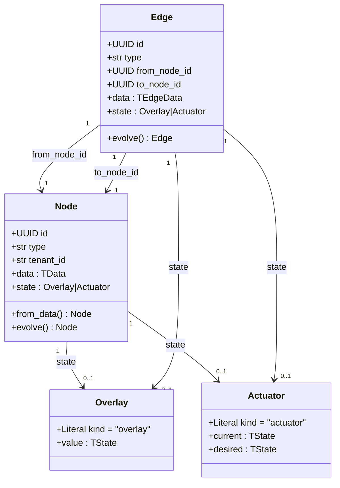

# Architecture

`vella-core` is a small set of pure-data shapes. A `Node` and an `Edge` are full
peers: both are frozen envelopes carrying a polymorphic `data` payload and an
optional polymorphic `state` envelope. State is either an `Overlay` (plain
mutable value) or an `Actuator` (a `current`/`desired` pair that a reconciliation
loop converges).

## State envelopes

`Overlay` is the 80% case — any property that changes more often than the core
data and has no actuator semantics (an email's `is_read`, a task's `done`). Read
it with `node.state.value.<field>` and update it with `update_state`.

`Actuator` models state that can be *commanded*: `current` is ground truth from
the world, `desired` is the full declarative target. A runtime reconciliation
loop converges `current` toward `desired` (level-triggered, so it self-heals on
restart). Update the target with `update_desired`.

Both are discriminated on the `kind` field, so a serialized envelope round-trips
back to the right shape without ambiguity.
